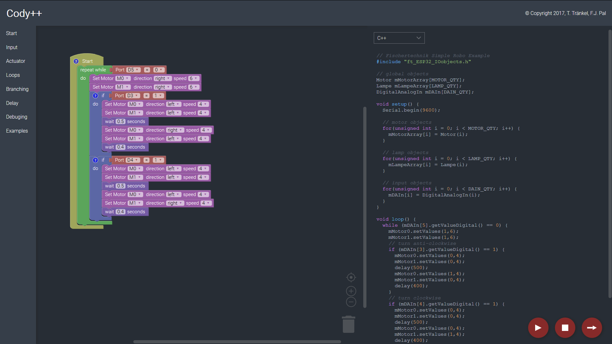
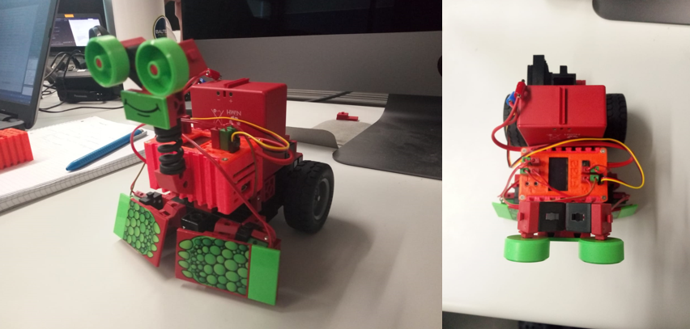
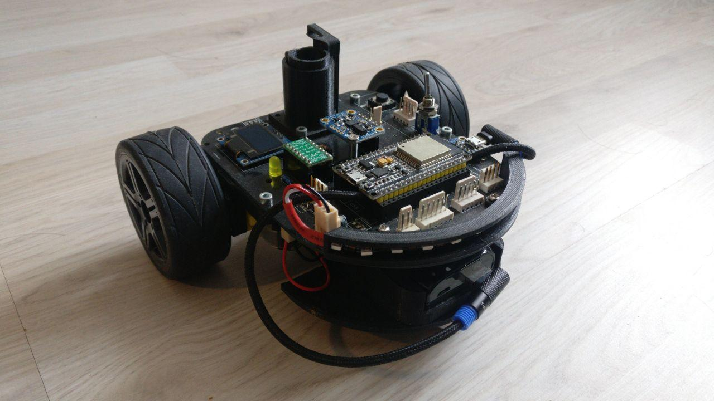
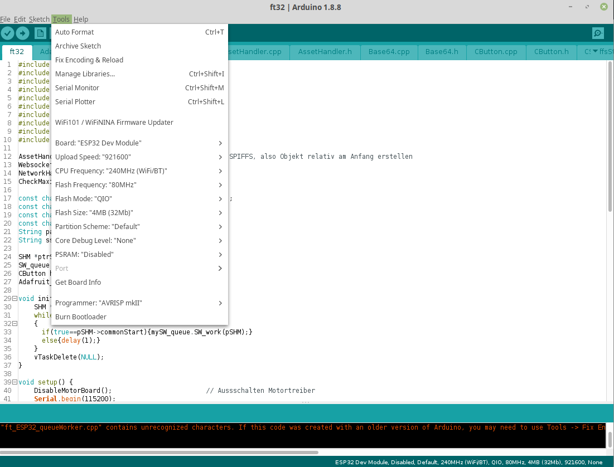

# Cody++

Cody++ is a simple and fast web IDE to create C++ applications for ESP32 microcontrollers based on arduino-code syntax. It can be used standalone in combination with our provided header files and our custom robots or alongside a backend to program and interact with the robots in realtime.

## Demo

Checkout the [demo](http://www.hit.hs-karlsruhe.de/hit%2Dinfo/info%2Dws17/Fischertechnik-Software-HMI/data/webIDEwebversion-1.1/index.html). If you want to take a look at some of the examples mentioned in the menu on the left hand side, feel free to do so.

## Quick start

So far, no installation instructions are needed. Feel free to use the hosted demo. To use our generated code, please follow the instructions below.

## Installation

First of all, we have to install several libraries to work with the current hardware setup. After installing the latest Arduino IDE version, we have to add the ESP32 core to our arduino installation. Therefore, an additional board manager URL has to be added. You can now go on with integrating the ESP32 core to arduino. To do so, you have to open your Arduino IDE and navigate to ``File -> Preferences -> Additional Boards Manager URLs`` and paste the [link]( https://dl.espressif.com/dl/package_esp32_index.json) given in the picture below into the input field.

Confirm the window, go to ``Tools -> Board -> Boards Manager...``, search for esp32, and once again confirm the installation and wait until all neccessary files are downloaded and set up. Now we can install the additional libraries to work with our custom hardware ([ft32](http://www.hit-karlsruhe.de/hit-info/info-ss19/FT32-HWK2/0401AusgewaehlteLoesung.html), [eMalRob](http://hit-karlsruhe.de/hit-info/info-ws19/MalRob_Platine/0406Platinenlayout.html)).

To get this done, open the menu entry under ``Tools -> Manage Libraries...`` and search for the following libraries and install them one by one:

- Adafruit BNO055 (latest version, tested with 1.1.11)
- Adafruit GFX Library (latest version, tested with 1.3.6)
- Adafruit NeoPixel (latest version, tested with 1.2.4)
- Adafruit SSD1306 (latest version, tested with 1.2.9)
- Adafruit Unified Sensor (latest version, tested with 1.1.2)
- ESP32 AnalogWrite (tested with 0.1.0)
- ESP8266 and ESP32 OLED driver for SSD1306 displays (tested with 4.1.0)
- SX1509 IO Expander (latest version, tested with 2.0.1)

## Generate and use Cody++ to build a program for the ESP32

Generate the arduino code with the hosted [Cody++ IDE](http://www.hit.hs-karlsruhe.de/hit%2Dinfo/info%2Dws17/Fischertechnik-Software-HMI/data/webIDEwebversion-1.1/index.html). After that, open your Arduino IDE and create a new blank sketch and paste the generated code into it. Now you only have to copy the neccessary headers - you find these files in the direcotry /lib - in the same directory where your arduino project is located. Compiling your first arduino project made with Cody++ should now be very easy. Its time to flash your ESP32. To do so, upload the compiled sketch to the ESP32 which should be connected with a usb cable to your computer. The following settings are neccessary:

Only a few steps are left to program your ESP32. Beside our Cody++ software and the Arduino IDE, you will need the correct [ESP32 hardware](http://hit-karlsruhe.de/hit%2Dinfo/info%2Dws18/Codypp%5FNet/0203StandDerTechnik.html). There are two possible hardware platfroms mentioned on our offical [documentation page](http://hit-karlsruhe.de/hit%2Dinfo/info%2Dws18/Codypp%5FNet/0406Layout.html), a ([ft32](http://www.hit-karlsruhe.de/hit-info/info-ss19/FT32-HWK2/0401AusgewaehlteLoesung.html) robot or the [eMalRob](http://hit-karlsruhe.de/hit-info/info-ws19/MalRob_Platine/0406Platinenlayout.html)). To setup the micro controller of each device correctly please visit the [ft32](https://github.com/hama1067/ft32) github page.

## Web documentation

For further information to this project visit our official documentation [webpage](http://hit-karlsruhe.de/hit-info/info-ws17/Fischertechnik/).

## Cody++ (with FT32 robots) in use

Video dokumentation (in german):

  

German pubils testing our Robots:

  

  

