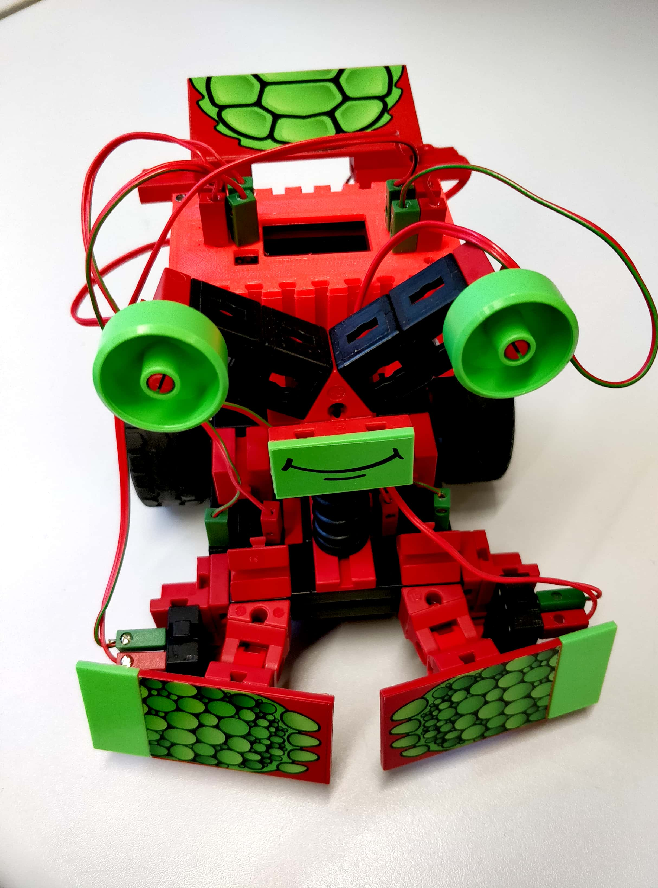

<p align="center"></p>

# Cody++

Cody++ is a simple and fast web IDE to create C++ applications for ESP32 microcontrollers based on arduino-code syntax.  

## Demo

Checkout the [demo](http://hit-karlsruhe.de/hit-info/FT32/codypp/#/). If you want to take a look at some of the examples mentioned in the menu on the left hand side, feel free to do so.

<p align="center"></p>

## Quick start

So far, no installation instructions are needed. Feel free to use the hosted demo. To use our generated code you have to install several libraries in [arduino](https://www.arduino.cc/en/Main/Software). You can install them after you open the Arduino IDE and search for them under Tools -> Manage Libraries. 

The following libraries should be installed:

- Adafruit SSD1306 (works only with version 1.1.2, not 1.2.x)
- Adafruit-GFX-Library (latest version, tested with 1.3.4)
- SparkFun SX1509 (latest version, tested with 2.0.1)

We also have to make sure that the ESP core is installed correctly. If you have a linux based oprating system, it is quite simple. Open an terminal enter the following commands:

``` bash
:~$ sudo usermod -a -G dialout $USER && \
    sudo apt-get install git && \
    wget https://bootstrap.pypa.io/get-pip.py && \
    sudo python get-pip.py && \
    sudo pip install pyserial && \
    mkdir -p ~/Arduino/hardware/espressif && \
    cd ~/Arduino/hardware/espressif && \
    git clone https://github.com/espressif/arduino-esp32.git esp32 && \
    cd esp32 && \
    git submodule update --init --recursive && \
    cd tools && \
    python2 get.py
```

The ESP core is using python the flash the microcontroller, so you have to check your python version. Python is preinstalled in most linux distributions.

``` bash
:~$ python --version
Python 2.7.15rc1
```

If you are under windows, you have to install python first. Therefore you have to download it from the [offical webpage](https://www.python.org/downloads/) and run the installer. You can now go on with integrating the ESP32 core to arduino. TO do so, you have to open your Arduino IDE and navigate to File -> Preferences -> Additional Boards Manager URLs. Paste the [link]( https://dl.espressif.com/dl/package_esp32_index.json) given in the picture below into the input field.

<p align="center"></p>

Confirm the window, wait until all neccessary files are installed and set up and proceed with the next steps.

### Generate and use Cody++ to build a program for the ESP32

Generate the arduino code with the hosted [Cody++ IDE](http://www.hit.hs-karlsruhe.de/hit%2Dinfo/info%2Dws17/Fischertechnik-Software-HMI/data/webIDEwebversion-1.1/index.html). After that, open your Arduino IDE and create a new blank sketch and paste the generated code into it. Now you only have to copy the neccessary headers (ft_ESP32_IOobjects.h, ft_ESP32_IOobjects.cpp) - you find these files in the direcotry [/lib](./libs), updated files can be found [here](https://github.com/hama1067/ft32/tree/master/ft32) - in the same directory where your arduino project is located. Compiling your first arduino project made with Cody++ should now be very easy. Its time to flash your ESP32. To do so, upload the compiled sketch to the ESP32 which should be connected with a usb cabel to your computer. The following settings are neccessary:

<p align="center"></p>

Only a few steps are left to program your ESP32. Beside our Cody++ software and the Arduino IDE, you will need the correct [ESP32 hardware](http://hit-karlsruhe.de/hit%2Dinfo/info%2Dws18/Codypp%5FNet/0203StandDerTechnik.html). There are two possible hardware platfroms mentioned on our offical [documentation page](http://hit-karlsruhe.de/hit%2Dinfo/info%2Dws18/Codypp%5FNet/0406Layout.html). I would prefer the smaller [one](http://www.hit-karlsruhe.de/hit%2Dinfo/info%2Dws18/FT%5FESP32%5FHWK/0401AusgewaehlteLoesung.html). To setup the ESP32 correctly please visit the [ft32](https://github.com/hama1067/ft32) github page.

## Web documentation

For further information to this project visit our official documentation [webpage](http://hit-karlsruhe.de/hit-info/info-ws17/Fischertechnik/).

<p align="center"></p>


## Cody++ (with FT32 robots) in use

Video dokumentation (in german): 

<p align="center" >
  <a href="http://www.youtube.com/watch?v=Vb2udfsyRjI" target="_blank" >
    
  </a>
</p>

German pubils testing our Robots: 

<p align="center" >
  <a href="http://www.youtube.com/watch?v=EfkDjtZDj-Y" target="_blank" >
    
  </a>
</p>

<p align="center" >
  <a href="http://www.youtube.com/watch?v=YJIpydJqEwY" target="_blank" >
    
  </a>
</p>

<!--## Environment Setup

If you want to take part or to modify and use the project on your own, you have to setup your operating system properly. I am currently using [Linux Mint 19](https://linuxmint.com/) and the following instructions are related to this operating system. Other Linux distributions are possible, but the commands may variant. It is also possible to setup and VM with [virtual box](https://www.virtualbox.org/). 

1)  Download and install Linux Mint 19.
2)  Make sure the latest updates are installed:
    ``` bash
    sudo apt-get update && sudo apt-get dist-upgrade --yes
    ```
3)  Download and install [Atom](https://atom.io/) (my favourite integrated development environment tool)
4)  Setup Atom IDE for syntax highlighting, language and github support:
    Launch Atom -> Edit -> Preferences -> Install:
    ``` bash
    Install packages: atom-ide-ui, ide-vue, Language-vue
    ```
5)  Install npm package manager:
    ...-->
